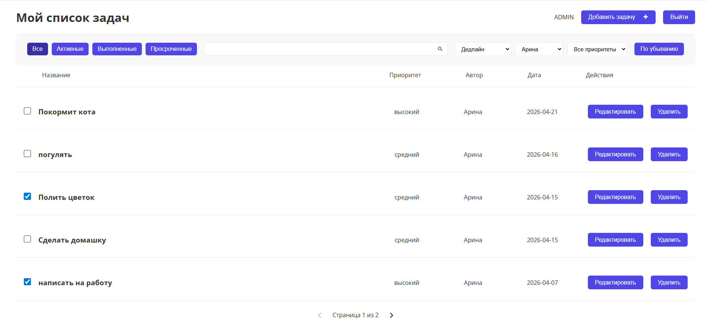
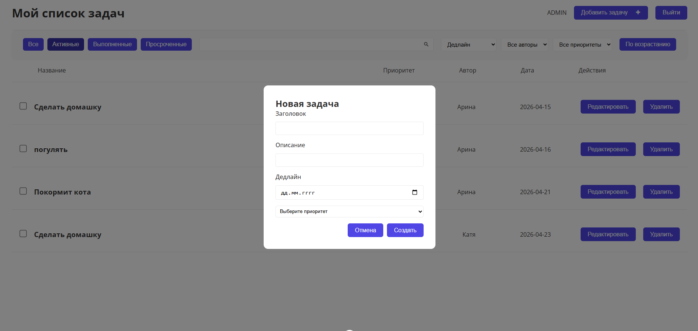
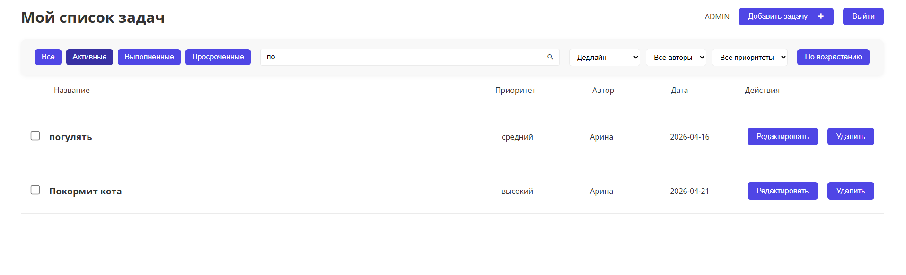
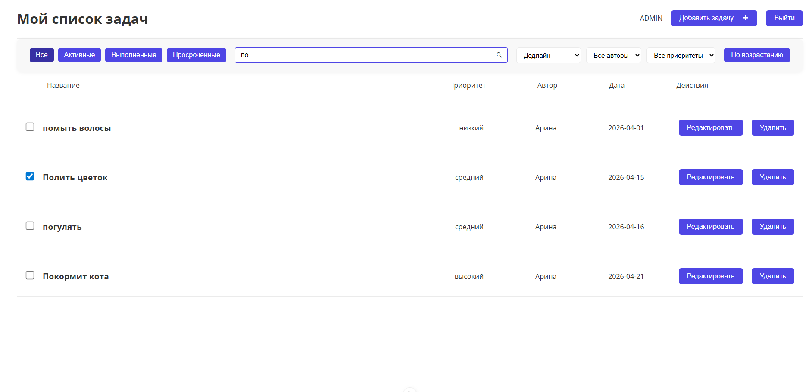
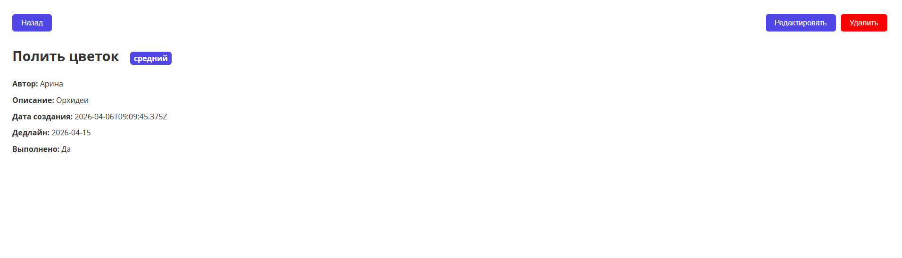
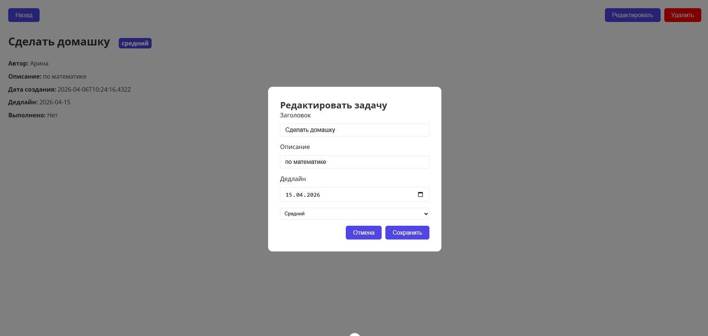

# 📌 README — ToDo Planner App (Nuxt + Vuex + SQLite)

## 📍 Название проекта

**ToDo Planner** — приложение для управления задачами с аутентификацией, фильтрами, сортировкой, пагинацией и красивым UI.

---

## 📋 Описание

Это SPA‑приложение для планирования задач (ToDo list), реализованное на **Nuxt 3 + Vue 3 + Vuex** с серверной частью на **Node.js + SQLite**.

Проект включает:

* Регистрацию и вход пользователей с JWT
* Просмотр, создание, редактирование и удаление задач
* Модальные окна
* Фильтры по статусу, приоритету и автору
* Сортировку по дедлайну, дате создания, приоритету и статусу
* Поиск по задачам
* Пагинацию

---

## 🧩 Функциональные требования

### ✅ 1. Авторизация и регистрация

* Регистрация по Email и паролю
* Вход с проверкой JWT
* Сохранение токена в `localStorage`
* Защита маршрутов для неавторизованных пользователей

---

### ✅ 2. Список задач

Каждая задача содержит:

* Заголовок
* Описание
* Приоритет (Высокий, Средний, Низкий)
* Дату создания
* Дату дедлайна
* Статус: выполнено / не выполнено
* Автор (имя пользователя)

Пользователь может:

* Добавлять задачи
* Редактировать задачи
* Удалять задачи
* Отмечать как выполненные

---

### ✅ 3. Фильтры

* По статусу: все, активные, выполненные, просроченные
* По приоритету: высокий, средний, низкий
* По автору задачи
* По текстовому поиску

---

### ✅ 4. Сортировка

* Дата дедлайна (`dueDate`)
* Дата создания (`createdAt`)
* Статус выполнения
* Автор задачи
* Приоритет

Сортировка может быть по возрастанию или убыванию.

---

### ✅ 5. Пагинация

* Разделение задач на страницы
* Навигация между страницами
* Поддержка фильтров и сортировки

---

## 🛠 Технологии

| Компонент      | Технология               |
| -------------- | ------------------------ |
| Фронтенд       | Nuxt 3, Vue 3, Vuex      |
| UI             | Компоненты + SCSS        |
| Аутентификация | JWT + localStorage       |
| Backend        | Node.js, SQLite, Express |
| API            | RESTful API              |
| Router         | Защищённые маршруты      |

---

## 🗂 Структура репозитория

```
📁 app/
├─ 📁 components/
│   ├─ AuthForm.vue
│   ├─ TaskCard.vue
│   ├─ TaskFilters.vue
│   ├─ Pagination.vue
│   ├─ ModalTaskForm.vue
│   ├─ AppHeader.vue
│   ├─ Button.vue
│   ├─ Input.vue
    ├─ ErrorModal.vue
    ├─ Loader.vue
    ├─ SearchBar.vue
    ├─ TaskList.vue
├─ 📁 pages/
│   ├─ index.vue
│   ├─ auth.vue
│   ├─ task/
│       └─ [id].vue
├─ 📁 layouts/
│   ├─ main.vue
│   ├─ auth.vue
├─ 📁 store/
│   ├─ auth.js
│   ├─ tasks.js
│   ├─ ui.js
├─ 📁 utils/
│   └─ api.js
├─ nuxt.config.ts
├─ package.json

├─ 📁 server/
│   ├─ server.js
│   ├─ controllers/
│   │   └─ tasks.controller.js
│   │   └─ auth.controller.js
│   ├─ entities/
│   │   └─ task.entity.js
│   │   └─ user.entity.js
│   ├─ config/
│       └─ db.config.js
└─ README.md
```

---

## 🖥 Фронтенд

* Nuxt 3 + Vue 3 SPA
* Vuex — глобальное состояние:

  * `auth.js` — аутентификация
  * `tasks.js` — задачи
  * `ui.js` — ошибки и загрузка
* Компоненты: карточки задач, фильтры, пагинация, модальные формы
* Реализована валидация форм и автосохранение при редактировании
* Динамический роутинг для детальной страницы задачи
* Inline-редактирование через модальные окна

---

### Примеры интерфейса

#### 📋 Список задач


#### ✏ Добавление задачи


#### Активные задачи


#### Выполненные задачи


#### 🔍 Поиск


#### 👁 Детали задачи


#### 📝 Редактирование



---

## 🗄 Backend

* Node.js + Express + SQLite
* REST API для работы с задачами и пользователями:

  * `POST /register` — регистрация
  * `POST /login` — вход
  * `GET /tasks` — список задач пользователя
  * `POST /tasks` — создание задачи
  * `PUT /tasks/:id` — обновление задачи
  * `DELETE /tasks/:id` — удаление задачи
* JWT для аутентификации
* SQLite хранит задачи и пользователей
* Модули: контроллеры, сущности (entities), конфиг БД

---

## ⚡ Запуск проекта

### 1) Установка зависимостей

```bash
npm install
# или
yarn install
```

---

### 2) Настройка переменных окружения

Создать `.env` в корне:

```bash
API_BASE_URL=http://localhost:3001/api
JWT_SECRET=your_jwt_secret
```

---

### 3) Запуск backend

```bash
node backend/server.js
```

или с nodemon:

```bash
nodemon backend/server.js
```

---

### 4) Запуск фронтенда

```bash
npm run dev
# или
yarn dev
```

---

## 📌 Особенности

* Модальные формы для редактирования и создания задач
* Inline валидация обязательных полей и дат
* Сохранение задач на сервере через REST API
* Автозагрузка задач после редактирования
* Быстрые фильтры и сортировка по всем полям

---

## 📷 Примеры интерфейса

* Список задач
* Добавление/редактирование задачи через модалку
* Детальная страница с приоритетом, автором и датами
* Фильтры и поиск

---

## 🛠 Дальнейшие улучшения

* Расширенные фильтры (по диапазону дат, нескольким полям)
* Анимации и плавный UI/UX
* Локализация интерфейса
* Тесты: Unit (Vitest) и E2E (Cypress)

