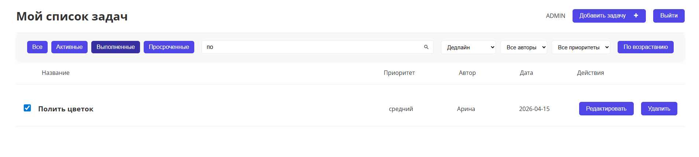

# 📌 README — ToDo Planner App (Nuxt + Vuex + SQLite)

## 📍 Название проекта

**ToDo Planner** — приложение для управления задачами с аутентификацией, фильтрами, сортировкой, пагинацией и красивым UI.

---

## 📋 Описание

Это SPA‑приложение для планирования задач (ToDo list), реализованное на **Nuxt 3 + Vue 3 + Vuex** с серверной частью на **Node.js + SQLite**.

Проект включает:

* Регистрацию и вход пользователей с JWT
* Просмотр, создание, редактирование и удаление задач
* Модальные окна
* Фильтры по статусу, приоритету и автору
* Сортировку по дедлайну, дате создания, приоритету и статусу
* Поиск по задачам
* Пагинацию

---

## 🧩 Функциональные требования

### ✅ 1. Авторизация и регистрация

* Регистрация по Email и паролю
* Вход с проверкой JWT
* Сохранение токена в `localStorage`
* Защита маршрутов для неавторизованных пользователей

---

### ✅ 2. Список задач

Каждая задача содержит:

* Заголовок
* Описание
* Приоритет (Высокий, Средний, Низкий)
* Дату создания
* Дату дедлайна
* Статус: выполнено / не выполнено
* Автор (имя пользователя)

Пользователь может:

* Добавлять задачи
* Редактировать задачи
* Удалять задачи
* Отмечать как выполненные

---

### ✅ 3. Фильтры

* По статусу: все, активные, выполненные, просроченные
* По приоритету: высокий, средний, низкий
* По автору задачи
* По текстовому поиску

---

### ✅ 4. Сортировка

* Дата дедлайна (`dueDate`)
* Дата создания (`createdAt`)
* Статус выполнения
* Автор задачи
* Приоритет

Сортировка может быть по возрастанию или убыванию.

---

### ✅ 5. Пагинация

* Разделение задач на страницы
* Навигация между страницами
* Поддержка фильтров и сортировки

---

## 🛠 Технологии

| Компонент      | Технология                           |
| -------------- | ------------------------------------ |
| Фронтенд       | Nuxt 3, Vue 3, Vuex                  |
| UI             | Компоненты + SCSS                    |
| Аутентификация | JWT + localStorage                   |
| Backend        | Node.js, SQLite, Express, TypeScript |
| API            | RESTful API                          |
| Router         | Защищённые маршруты                  |

---

## 🗂 Структура репозитория

```
📁 nuxt/
├─ 📁 assets/
├─ 📁 components/
│   ├─ AuthForm.vue
│   ├─ TaskCard.vue
│   ├─ TaskFilters.vue
│   ├─ Pagination.vue
│   ├─ ModalTaskForm.vue
│   ├─ AppHeader.vue
│   ├─ Button.vue
│   ├─ Input.vue
│   ├─ ErrorModal.vue
│   ├─ Loader.vue
│   ├─ SearchBar.vue
│   └─ TaskList.vue
├─ 📁 pages/
│   ├─ index.vue
│   ├─ auth.vue
│   └─ task/
│       └─ [id].vue
├─ 📁 layouts/
│   ├─ main.vue
│   └─ auth.vue
├─ 📁 store/
│   ├─ auth.js
│   ├─ tasks.js
│   └─ ui.js
├─ 📁 utils/
│   └─ api.js
├─ nuxt.config.ts
└─ package.json

📁 server/
├─ 📁 src/
│   ├─ 📁 controllers/
│   │   ├─ tasks.controller.ts
│   │   └─ auth.controller.ts
│   ├─ 📁 entities/
│   │   ├─ task.entity.ts
│   │   └─ user.entity.ts
│   ├─ 📁 dto/
│   │   ├─ task.dto.ts
│   │   └─ auth.dto.ts
│   ├─ 📁 config/
│   │   └─ db.config.ts
│   ├─ 📁 middlewares/
│   │   └─ auth.middleware.ts
│   ├─ 📁 types/
│   │   └─ express.d.ts
│   ├─ 📁 repositories/
│   │   ├─ task.repository.ts
│   │   └─ user.repository.ts
│   ├─ 📁 services/
│   │   ├─ task.service.ts
│   │   └─ auth.service.ts
│   ├─ 📁 routes/
│   │   ├─ task.routes.ts
│   │   └─ user.routes.ts
│   └─ app.ts
├─ 📁 data/
│   └─ db.sqlite
└─ package.json
```

---

## 🖥 Фронтенд

* Nuxt 3 + Vue 3 SPA
* Vuex — глобальное состояние:

  * `auth.js` — аутентификация
  * `tasks.js` — задачи
  * `ui.js` — ошибки и загрузка
* Компоненты: карточки задач, фильтры, пагинация, модальные формы
* Реализована валидация форм и автосохранение при редактировании
* Динамический роутинг для детальной страницы задачи
* Inline-редактирование через модальные окна

---

### Примеры интерфейса

#### 📋 Список задач


#### ✏ Добавление задачи


#### Активные задачи


#### Выполненные задачи


#### 🔍 Поиск


#### 👁 Детали задачи


#### 📝 Редактирование


---

## 🗄 Backend

* Node.js + Express + SQLite
* REST API для работы с задачами и пользователями:

  * `POST /api/auth/register` — регистрация
  * `POST /api/auth/login` — вход
  * `GET /api/tasks` — список задач пользователя
  * `POST /api/tasks` — создание задачи
  * `PUT /api/tasks/:id` — обновление задачи
  * `DELETE /api/tasks/:id` — удаление задачи
* JWT для аутентификации
* SQLite хранит задачи и пользователей
* Модули: контроллеры, сущности (entities), конфиг БД, сервисы, роуты, миддлвейр, dto и тд

---

## ⚡ Требования и установка — что нужно скачать и настроить

Перед тем как начать работу с проектом, разработчикам нужно подготовить окружение.

### 📌 1) Установить Node.js (обязательно)

🔹 Проект написан на **Node.js + Nuxt 3**, поэтому требуется:

```bash
Node.js v18 или новее (рекомендуется LTS)
```

📌 Nuxt 3 работает только на Node.js и требует современного движка и менеджера пакетов для установки зависимостей. ([nweb42.com][1])

Проверить версию:

```bash
node -v
```

Если версия ниже — обнови через nvm, официальные инсталляторы или другой менеджер версий.

---

### 📌 2) Менеджер пакетов

Проект использует зависимости из `package.json`, которые устанавливаются через:

```bash
npm install
# или
yarn install
# или
pnpm install
```

📌 Можно использовать любой удобный менеджер пакетов (npm, yarn, pnpm). ([nweb42.com][1])

---

### 📌 3) Поддержка TypeScript (для backend’a)

Бэкенд написан на **TypeScript**, поэтому разработчикам нужны инструменты для TypeScript:

✅ Установить TypeScript и типы (если их нет):

```bash
npm install -D typescript
npm install -D ts-node @types/node
```

🔹 `ts-node` позволяет запускать `.ts` файлы без предварительной компиляции через `tsc`. ([DEV Community][2])
---

### 📌 4) SQLite и драйвер для него

Проект использует SQLite в backend’e, поэтому необходимо установить драйвер:

```bash
npm install sqlite3
```

🔹 SQLite — это встроенная база данных, которая не требует отдельного сервера, но требует соответствующий npm‑пакет для Node.js.

---

### 📌 5) Создать `.env` и переменные окружения

Файл `.env` уже игнорируется в `.gitignore`, и каждому разработчику нужно создать его локально:

```
API_BASE_URL=http://localhost:3001/api
JWT_SECRET=секретный_ключ
DATABASE_PATH=./server/data/db.sqlite
```

✔ без этого backend **не запустится корректно**.

---

### 📌 6) Nodemon (опционально)

Для удобного запуска backend’a во время разработки:

```bash
npm install -D nodemon
```

Запуск:

```bash
npx nodemon src/app.ts
```

---

## 🚀 Запуск проекта — по шагам

### 1) Установка зависимостей

```bash
npm install
# или
yarn install
```

---

### 2) Настройка `.env`

Создаём `.env` в корне и добавляем:

```
JWT_SECRET=твой_секрет
JWT_EXPIRES_IN=3600
```

---

### 3) Запуск backend (Node.js + Express + TS)

```bash
npm run dev
```

или через Nodemon:

```bash
nodemon src/app.ts
```

---

### 4) Запуск frontend (Nuxt 3)

```bash
npm run dev
# или
yarn dev
```

---

## 📌 Особенности

* Модальные формы для редактирования и создания задач
* Inline валидация обязательных полей и дат
* Сохранение задач на сервере через REST API
* Автозагрузка задач после редактирования
* Быстрые фильтры и сортировка по всем полям

---

## 🛠 Дальнейшие улучшения

* Расширенные фильтры (по диапазону дат, нескольким полям)
* Анимации и плавный UI/UX
* Локализация интерфейса
* Тесты: Unit (Vitest) и E2E (Cypress)

